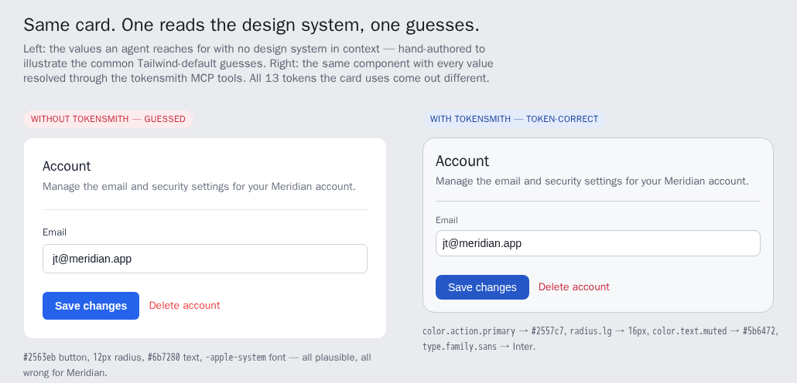

# tokensmith

**Make coding agents design-system-aware.** An MCP server that gives any agent
(Claude Code, Claude Desktop, Cursor) first-class access to a design system's
tokens — so the UI it writes can be *on-system* instead of a pile of guessed hex
values.

An agent writing UI today has no idea your design system exists. It reaches for
`#2563eb` because that's the blue it remembers. tokensmith is the bridge: expose a
design system (W3C [Design Tokens / DTCG](https://tr.designtokens.org/) `tokens.json`)
over MCP so the agent *queries* the system — resolving `color.action.primary` to the
real value, following alias chains — instead of inventing one.

> **Scope, honestly.** tokensmith makes the design system *available* to the agent over
> MCP; it does not yet *enforce* that the agent calls the tools or follows their output.
> Today it removes the excuse to guess — it doesn't yet prevent guessing. Closing that
> gap (verify generated UI actually used the tokens) is the [roadmap](#status--roadmap).

---

## The 30-second demo



*Left: the values an agent reaches for with no design system in context (hand-authored to show the common Tailwind-default guesses). Right: the same component with every value resolved through tokensmith. The drift is subtle on purpose — that's exactly why it ships unnoticed. Open [`demo/preview.html`](./demo/preview.html) to view it live.*

The [`demo/`](./demo/) directory holds one component, `SettingsCard`, two ways:

- [`without.tsx`](./demo/without.tsx) — a hand-authored illustration of the values an
  agent (or a dev working from memory) reaches for when the design system isn't in
  context: generic Tailwind defaults. It's a worked example, not a captured model run.
- [`with.tsx`](./demo/with.tsx) — the same component with every literal resolved live
  through the tokensmith MCP tools, each one citing the token path it came from. These
  values are real tool output.

Guessed vs. resolved, one row per distinct token the card uses:

| Role | Token path | Guessed | Token-correct |
|---|---|---|---|
| Primary action bg | `color.action.primary` | `#2563eb` | `#2557c7` |
| Card surface | `color.surface.raised` | `#ffffff` | `#f7f8fa` |
| Card radius | `radius.lg` | `12px` | `16px` |
| Muted text | `color.text.muted` | `#6b7280` | `#5b6472` |
| Font family | `type.family.sans` | `-apple-system` | `Inter` |
| … | | **all 13 tokens differ** | |

Not one Tailwind default landed on a Meridian token. `#2563eb` vs `#2557c7` renders as
"blue," passes visual review, and ships — that is exactly the drift a token system
exists to prevent, and exactly the drift an LLM reintroduces the moment it can't read
the tokens. Full breakdown, honest caveats, and the alias chains in
[`demo/README.md`](./demo/README.md).

---

## Quickstart

Requires Node 20+.

```bash
git clone https://github.com/jtmchorse/tokensmith
cd tokensmith
npm install
npm run build
```

Point it at your own DTCG token file, or use the bundled `Meridian` example:

```bash
# Claude Code — project scope, bundled example tokens
claude mcp add tokensmith -s project -- node "$(pwd)/dist/index.js"

# …or with your own tokens.json
claude mcp add tokensmith -s project -- node "$(pwd)/dist/index.js" /abs/path/tokens.json
```

Claude Desktop (`claude_desktop_config.json`, then fully quit + reopen):

```json
{ "mcpServers": { "tokensmith": { "command": "node", "args": ["/abs/path/dist/index.js"] } } }
```

The token file resolves from `argv[2]`, then `TOKENS_PATH`, then the bundled
[`examples/tokens.json`](./examples/tokens.json).

---

## Tools

| Tool | What it does |
|---|---|
| **`list_tokens(group?)`** | Resolved listing `{path, type, value, aliasOf?, description?}`, optionally filtered by a group prefix like `"color.action"`. |
| **`resolve_token(name)`** | Resolves one token to `{path, value, type, chain, isAlias, description}`. The `chain` is the whole point — it shows the full alias walk. |
| **`ping`** | Health check → `pong`. |

`resolve_token` follows alias chains to their terminal value and hands back the path it
walked:

```
resolve_token  color.action.primary
  → { value: "#2557c7",
      chain: ["color.action.primary", "color.brand.primary", "color.base.blue-600"] }
```

That indirection is the value: a designer repoints `brand.primary` once, and every
consumer that asked for `action.primary` moves with it. A guessed hex is frozen at
whatever the model remembered.

---

## How it works

- **DTCG loader** (`src/dtcg/`) — walks a W3C `tokens.json`, inherits `$type` down
  through groups, flattens to a `Map<dot.path, token>`, and detects aliases. Fails loud
  with the offending path.
- **Alias resolver** (`src/dtcg/resolver.ts`) — resolves whole-`$value` aliases through
  chains of arbitrary depth with a visited-set **cycle guard** (self-reference, 2-node,
  and mid-chain loops all caught). Unknown paths get a nearest-miss *"did you mean"* hint.
- **MCP server** (`src/index.ts`) — registers the three tools over stdio; resolver and
  parse failures surface as MCP tool errors with the message (and hints) intact.
- **Tested core** — `npm test` (vitest), 34 cases across loader + resolver, including
  every error path.

The `Meridian` example is an invented, clean-room design system: 62 tokens, 21 aliases,
chains up to 3 deep, built so resolution demos show something real. Modes (light/dark)
and composite-value references are deferred past v0.0.

---

## Status & roadmap

**`v0.0`** — walking skeleton, working end-to-end:

- ✅ **M0** stdio MCP pipe · ✅ **M1** DTCG loader · ✅ **M2** alias resolver + cycle guard
- ✅ **M3** `list_tokens` + `resolve_token` · ✅ **M4** live in a Claude client + the demo

**Next (`v0.1`+):** design-system-aware *generation* (not just lookup), token **audit** of
existing code, light/dark modes, composite-value references, and round-trip to Figma.

---

## Notes for contributors

On a stdio MCP server, **stdout is the JSON-RPC channel.** A single stray `console.log`
to stdout corrupts the stream and the client silently fails to connect. All logging goes
to stderr. If it "won't connect for no reason," that is suspect #1.

## License

MIT
